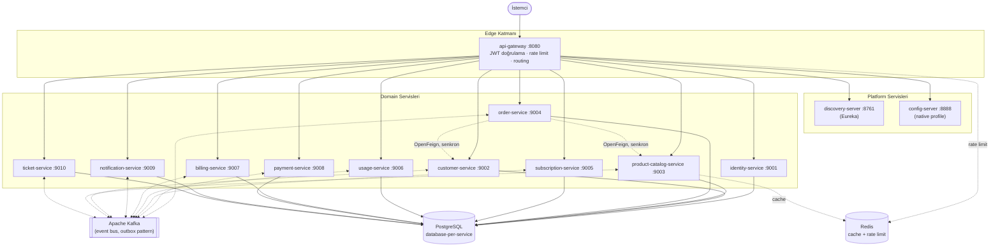
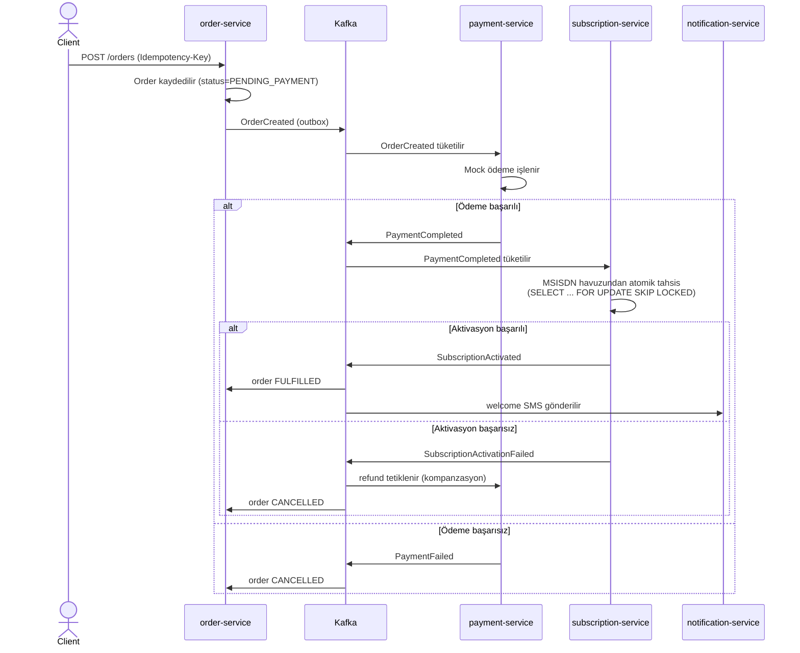
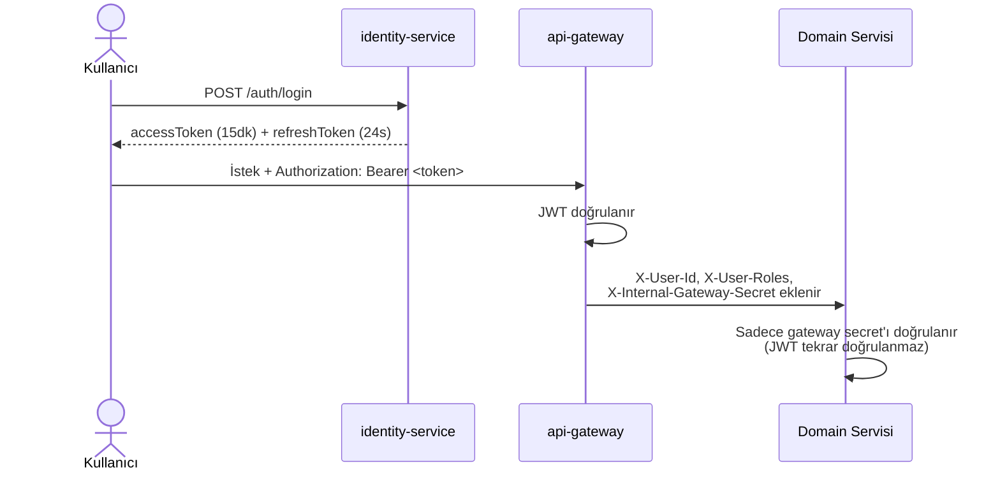
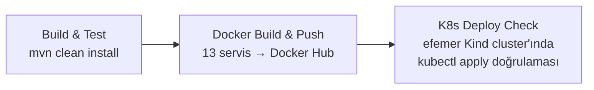

<div align="center">

# TelcoX CRM Platform

**Event-driven, database-per-service bir GSM operatörü CRM mikroservis platformu**


Developed by **Pair 6** — İsmail Furkan Bilen & Nurgül Yalman

</div>

---

## İçindekiler

- [Genel Bakış](#genel-bakış)
- [Mimari](#mimari)
- [Saga Akışı: Yeni Abone Onboarding](#saga-akışı-yeni-abone-onboarding)
- [Teknoloji Yığını](#teknoloji-yığını)
- [Servisler](#servisler)
- [Proje Yapısı](#proje-yapısı)
- [Güvenlik Mimarisi](#güvenlik-mimarisi)
- [Veri Tutarlılığı: Transactional Outbox](#veri-tutarlılığı-transactional-outbox)
- [Çalıştırma](#çalıştırma)
- [Sorun Giderme](#sorun-giderme)
- [Test Etme](#test-etme)
- [CI/CD](#cicd)
- [Bilinen Sınırlamalar](#bilinen-sınırlamalar)

---

## Genel Bakış

TelcoX CRM Platform, bir GSM operatörünün abone yaşam döngüsünü — kayıt/KYC, tarife siparişi, abonelik aktivasyonu, kullanım/kota takibi, faturalandırma, ödeme, bildirim, destek talebi — uçtan uca yöneten **13 mikroservisten** oluşan bir platformdur. Her servis kendi PostgreSQL şemasına sahiptir (database-per-service); servisler arası kritik akışlar (sipariş → ödeme → abonelik aktivasyonu) senkron bir orkestratör yerine **Apache Kafka üzerinden choreography-based bir saga** ile yürütülür.

## Mimari



**Senkron / Asenkron ayrımı:**

| Etkileşim | Tip | Gerekçe |
|---|---|---|
| Order → Customer/ProductCatalog doğrulaması | Senkron (OpenFeign) | Sipariş anında fiyat/müşteri geçerliliği kesin bilinmeli |
| Order → Payment → Subscription | Asenkron (Kafka, choreography) | Adımlar geri alınabilir, servisler birbirini bloklamamalı |
| CDR → Usage → Billing (aşım) | Asenkron (Kafka) | Yüksek hacim, eventual consistency kabul edilebilir |
| Domain event'leri → Notification | Asenkron (Kafka) | Bildirim kanalı çökse bile ana akış etkilenmemeli |

## Saga Akışı: Yeni Abone Onboarding

`order-service` merkezi bir orkestratör değildir; her servis kendi event'ini tüketip bir sonrakini üretir (**choreography-based saga**):



`SagaState` entity'si her siparişin hangi adımda olduğunu tutan gerçek bir state machine'dir.

## Teknoloji Yığını

| Katman | Teknoloji | Versiyon |
|---|---|---|
| Dil | Java | 21 |
| Framework | Spring Boot | 3.3.13 |
| Servis Keşfi / Config / Gateway | Spring Cloud | 2023.0.6 |
| Mesajlaşma | Spring Cloud Stream (Kafka binder) | — |
| Veritabanı | PostgreSQL + Flyway | 16 |
| Cache / Rate Limit | Redis | 7 |
| Event Bus | Apache Kafka (KRaft) | 3.7.0 |
| API Dokümantasyonu | springdoc-openapi | 2.6.0 |
| Dayanıklılık | Resilience4j | 2.3.0 |
| Gözlemlenebilirlik | Micrometer + Brave (Zipkin), Prometheus, Logstash | — |
| Test | JUnit 5, Mockito, AssertJ, Testcontainers | 1.21.4 |
| Konteynerizasyon | Docker, Docker Compose, Kubernetes (Kustomize) | — |
| CI/CD | GitHub Actions | — |

## Servisler

| Servis | Port | Sorumluluk | Temel Agregatlar |
|---|---|---|---|
| discovery-server | 8761 | Eureka service registry | — |
| config-server | 8888 | Merkezi konfigürasyon (native profile) | — |
| api-gateway | 8080 | Edge routing, JWT doğrulama, rate limiting | — |
| identity-service | 9001 | Kullanıcı/rol/yetki, JWT üretimi | User, Role, Permission |
| customer-service | 9002 | Müşteri kaydı, KYC, PII şifreleme | Customer, Address, Document |
| product-catalog-service | 9003 | Tarife/addon kataloğu, Redis cache | Tariff, TariffVersion, Addon |
| order-service | 9004 | Sipariş + saga orkestrasyonu | Order, OrderItem, SagaState |
| subscription-service | 9005 | Abonelik yaşam döngüsü, MSISDN havuzu | Subscription, MsisdnPool, SimCard |
| usage-service | 9006 | CDR işleme, kota takibi | Quota, UsageRecord, CdrEvent |
| billing-service | 9007 | Fatura üretimi (PDF dahil) | Invoice, InvoiceLine, UsageAggregate |
| payment-service | 9008 | Mock PSP ile ödeme | Payment, PaymentAttempt |
| notification-service | 9009 | Mock SMS/e-posta bildirimi | Notification, NotificationTemplate |
| ticket-service | 9010 | Destek talebi/SLA | Ticket, TicketComment |

## Proje Yapısı

```
├── discovery-server/            # Eureka
├── config-server/                # Spring Cloud Config (native profile)
├── api-gateway/                   # Edge routing + JWT
├── identity-service/              # Kimlik & yetki
├── customer-service/              # Müşteri yönetimi
├── product-catalog-service/       # Tarife/addon kataloğu
├── order-service/                  # Sipariş + saga orkestrasyonu
├── subscription-service/          # Abonelik yaşam döngüsü
├── usage-service/                  # CDR & kota takibi
├── billing-service/                # Faturalandırma
├── payment-service/                # Ödeme (mock PSP)
├── notification-service/          # Bildirim (mock SMS/e-posta)
├── ticket-service/                 # Destek talepleri
├── configs/                        # config-server'ın sunduğu servis bazlı ayarlar
├── init-scripts/                   # Postgres ilk kurulum (servis başına DB)
├── k8s/                            # Kubernetes manifestleri (base + CI overlay)
├── scripts/                        # Yardımcı script'ler (senaryo testi, CDR simülatörü)
├── observability/                  # Prometheus/Grafana/Logstash konfigürasyonu
├── docker-compose.yml
└── .github/workflows/ci-cd.yml     # Build → test → docker push → k8s deploy check
```

Her servis aynı standart paket yapısını izler: `entity/ · repository/ · service/ · controller/ · mapper/ · dto/ · exception/ · config/` ve Flyway migration'ları (`src/main/resources/db/migration/`).

## Güvenlik Mimarisi



- JWT (HS256): access token **900000 ms (15 dk)**, refresh token **86400000 ms (24 saat)**.
- `api-gateway` her isteği doğrulayıp `X-User-Id`/`X-User-Roles` header'larını ekler; downstream servisler JWT'yi tekrar doğrulamaz, paylaşılan bir internal secret'a (`X-Internal-Gateway-Secret`) güvenir.
- `customer-service`'te kimlik numarası alanı AES-256-GCM ile alan seviyesinde şifrelenir.
- Gateway'de Redis tabanlı istek sınırlama: `replenishRate=2`, `burstCapacity=100`, `requestedTokens=1` (token bucket algoritması).

## Veri Tutarlılığı: Transactional Outbox

Bir servisin DB yazması ile Kafka'ya event yayınlaması tek bir transaction'da atomik garanti edilemediği için (dual-write problemi), her yazma işlemi aynı DB transaction'ı içinde bir `outbox_events` satırı da yazar. Ayrı bir `OutboxEventPublisher` (`@Scheduled`, 5 saniye periyot) bu tabloyu tarayıp Kafka'ya gönderir — **en-az-bir-kez teslimat** garantisi sağlar. Tüketici tarafında `source_event_id` üzerine `UNIQUE` constraint ile **idempotent consumer** garantisi tamamlanır. Bu pattern 9 servise uygulanmıştır (`identity-service` yayınlayacağı bir domain event'i olmadığı için hariçtir).

## Çalıştırma

### Ön Koşullar

- [Docker Desktop](https://www.docker.com/products/docker-desktop/) (Docker Compose dahil), **çalışır durumda ve açık** olmalı
- Kubernetes ile çalıştırmak isteyenler için: `kubectl` + bir cluster (Minikube/Kind)
- Git

### Adım Adım: Docker Compose ile Çalıştırma

**1. Depoyu klonlayın**

```bash
git clone <repo-url>
cd TELCO-CRM-PLATFORM
```

**2. Ortam değişkenlerini oluşturun**

Repo, gerçek sırları (`.env`) değil sadece bir şablonu (`.env.example`) içerir — ilk kurulumda bunu kopyalamanız gerekir:

```bash
cp .env.example .env
```
```powershell
Copy-Item .env.example .env
```

`.env` içindeki `change-me` değerlerini olduğu gibi bırakabilirsiniz (lokal geliştirme için sorun teşkil etmez), production'a taşırken mutlaka değiştirin.

**3. Docker Desktop'ın çalıştığından emin olun**

```bash
docker info
```

Bu komut hata verirse Docker Desktop henüz açılmamış demektir; açıp tekrar deneyin.

**4. Tüm platformu ayağa kaldırın**

```bash
docker compose up -d
```

İlk çalıştırmada 13 servisin image'ı sıfırdan build edileceği için bu adım birkaç dakika sürebilir.

**5. Servislerin sağlıklı olduğunu doğrulayın**

```bash
docker compose ps
```

Tüm servislerin `STATUS` sütununda `healthy` yazana kadar bekleyin (discovery-server ve config-server'ın ayağa kalkması, ardından domain servislerinin onları bulması biraz zaman alır).

**6. Erişim**

- API Gateway: `http://localhost:8080`
- Her domain servisinin kendi Swagger UI'ı: `http://localhost:<port>/swagger-ui.html`
- Seed admin kullanıcısı: `admin` / `Admin123!`

**7. (Opsiyonel) Gözlemlenebilirlik yığınını açın**

```bash
docker compose --profile observability up -d
```

Zipkin, Prometheus, Grafana ve ELK yığınını da ayağa kaldırır (varsayılan olarak kapalıdır, Elasticsearch tek başına ~1GB ek bellek gerektirir).

**8. Durdurmak/temizlemek için**

```bash
docker compose down       # container'ları durdurur, veri (volume) kalır
docker compose down -v    # container'ları VE tüm veriyi siler
```

### Kubernetes ile Çalıştırma

```bash
kind create cluster --name telco-local        # veya minikube start
kubectl apply -f k8s/base/namespace.yaml
kubectl create secret generic telco-secrets --from-env-file=.env -n telco-crm
kubectl kustomize --load-restrictor LoadRestrictionsNone k8s/base | kubectl apply -f -
kubectl get pods -n telco-crm -w               # hepsi Running/Ready olana kadar bekleyin
kubectl port-forward svc/api-gateway 8080:8080 -n telco-crm
```

> `kubectl apply -k` yerine `kubectl kustomize ... | kubectl apply -f -` kullanılmasının nedeni: manifestler `configs/` ve `init-scripts/` klasörlerine `k8s/` dışından referans veriyor, `kubectl apply -k` bunu güvenlik gerekçesiyle reddediyor.

## Sorun Giderme

Kurulum sırasında karşılaşılabilecek yaygın sorunlar ve çözümleri:

| Sorun | Olası Neden | Çözüm |
|---|---|---|
| `docker compose up` sırasında `POSTGRES_USER variable is not set` uyarısı | `.env` dosyası oluşturulmamış | `cp .env.example .env` çalıştırıp tekrar deneyin |
| `Conflict. The container name "/telco-*" is already in use` | Daha önceki bir `docker compose` denemesinden kalan durdurulmuş container | `docker rm <container-adı>` ile silin veya `docker compose down -v` ile tamamen temizleyin |
| Postgres loglarında `sorry, too many clients already` | HikariCP havuz boyutları ile Postgres'in `max_connections`'ı senkron değil | `docker-compose.yml`'deki `postgres` servisinin `max_connections=200` komutu ile `configs/application.yaml`'daki global Hikari `maximum-pool-size` ayarının birlikte durduğunu doğrulayın |
| Bir servisi `mvn spring-boot:run` ile host üzerinde çalıştırırken `Could not resolve placeholder` hatası | `.env` değişkenleri o terminal oturumuna yüklenmemiş | `. .\scripts\load-env.ps1` (PowerShell) veya `source scripts/load-env.sh` (bash) ile yükleyin — her yeni terminal için ayrı ayrı gerekir |
| Testcontainers tabanlı testler (`*ConcurrencyTest`, `*IntegrationTest`) `Could not find a valid Docker environment` hatası veriyor | Docker Desktop kapalı | Docker Desktop'ı açıp testi tekrar çalıştırın |
| `kubectl apply -k k8s/base` bir "security" / "is not in or below" hatası veriyor | Manifestler `k8s/` dışındaki `configs/`/`init-scripts/`'e referans veriyor, kustomize'ın varsayılan güvenlik kısıtlaması bunu reddediyor | Bunun yerine `kubectl kustomize --load-restrictor LoadRestrictionsNone k8s/base \| kubectl apply -f -` kullanın |
| Kubernetes'te Kafka pod'u `CrashLoopBackOff`'a giriyor veya diğer pod'lar uzun süre `Init:`/`Pending` kalıyor | Kaynak kısıtlı bir cluster'da (ör. laptop üzerinde Kind/Minikube) 16 workload aynı anda ayağa kalkmaya çalışıyor | Birkaç dakika bekleyin; kalıcıysa `kubectl get pods -n telco-crm` ve `kubectl describe pod <pod-adı> -n telco-crm` ile ayrıntıya bakın |
| PC/Docker Desktop yeniden başlatıldıktan sonra bazı K8s pod'ları `Unknown` durumunda takılı kalıyor | Kind, bir host reboot'unu her zaman zarifçe atlatamıyor | `kubectl delete pods --field-selector=status.phase!=Running -n telco-crm` ile temizleyin, Deployment'lar otomatik yeniden oluşturur |
| Docker Compose ve Kubernetes aynı anda çalıştırılınca sistem çok yavaşlıyor | İki ayrı yığın (13+ container ve 16+ pod) aynı host kaynaklarını paylaşıyor | İkisini aynı anda çalıştırmayın; birini kullanırken diğerini durdurun (`docker compose stop` / `kind delete cluster`) |
| Swagger UI veya `/actuator/health` yanıt vermiyor | Servis henüz tam ayağa kalkmamış olabilir | `docker compose ps` (veya `kubectl get pods`) ile servisin `healthy`/`Ready` olduğunu doğrulayın, discovery-server ve config-server'ın önce ayakta olması gerekir |

## Test Etme

Seed admin kullanıcısı: `admin` / `Admin123!` (`POST /api/v1/auth/login`).

```powershell
.\scripts\scenario-checks.ps1
```
```bash
./scripts/scenario-checks.sh
```

Bu script, sistemi 3 uçtan uca kabul senaryosuyla (yeni abone onboarding, aylık fatura, kota aşımı) gerçek HTTP çağrıları üzerinden adım adım test eder ve sonucu ekrana basar.

## CI/CD

`.github/workflows/ci-cd.yml`, `main`/`nurgul`'e her push'ta üç aşamalı çalışır:



## Bilinen Sınırlamalar

| Konu | Durum |
|---|---|
| Resilience4j (circuit breaker + retry) | Yalnızca `order-service`'in `CustomerServiceGateway` ve `ProductCatalogServiceGateway` Feign client'larında uygulanmıştır |
| CI/CD K8s doğrulaması | Şu an 13 servisin yalnızca 6'sını (postgres, redis, discovery-server, config-server, api-gateway, identity-service) kapsar |
| Kapsam dışı özellikler | Prepaid top-up, MNP, kurumsal müşteri yönetimi, kampanya motoru, roaming, mobil uygulama |
